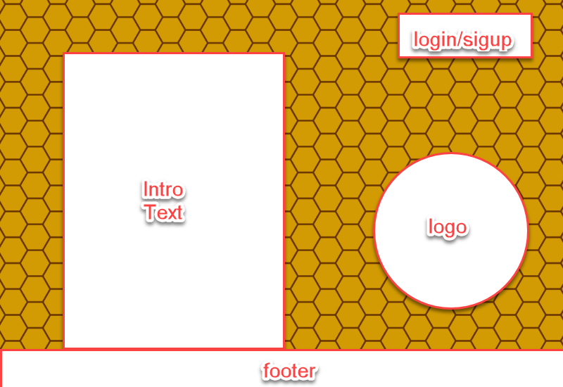
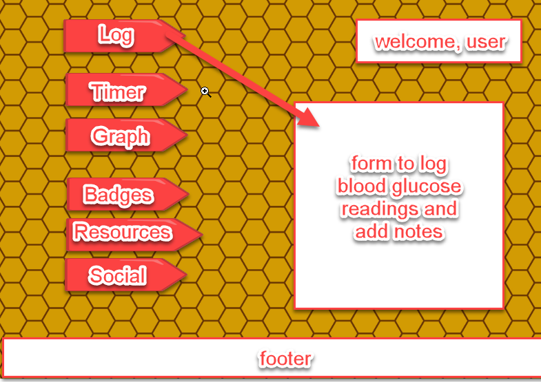
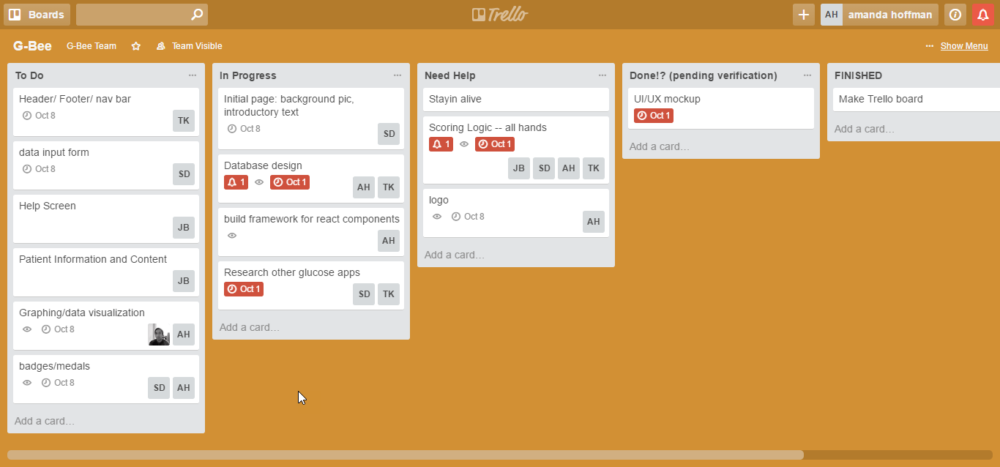

# G-Bee

##Overview:

Our application is G-Bee, the Blood Glucose tracking app. Our goal is to inspire diabetic patients to better track their blood glucose readings with virtual medals and data visualization. It is valuable for diabetic patients to better understand and manage their blood glucose levels to minimize diabetic complications.  Our app will reward patients for logging their results and achieving glucose readings within ADA guidelines. The app will also make data available for review with a patient's healthcare team.

[Minutes from Original Planning](../blob/master/Final Project - GBee.doc)

[Original Artboard](../blob/master/screenshots/gbee.pdf)

## Design Layout:

**Splash Page:**

**After Sign In:**

**Features:**

**Logs**

**Timer**

**Graphs**

**Badges**

**Resources**

**Social**

## Roles:

* Amanda Hoffman: Team Captain/ Architect
* Julian Biebelberg: Patient Information Content Manager
* Rangy Abines: Data Visualization/ UX Design
* Stephen Doe: UX Research and Design/ Git Conflict Manager
* Tom Keel: Database Administration/ Secretary

## Schedule (see Trello for details):

* 10/1: basic framework and layout
* 10/8: working prototype
* 10/15: live app

##Project Management (Trello):

https://trello.com/b/SntazucZ/g-bee

